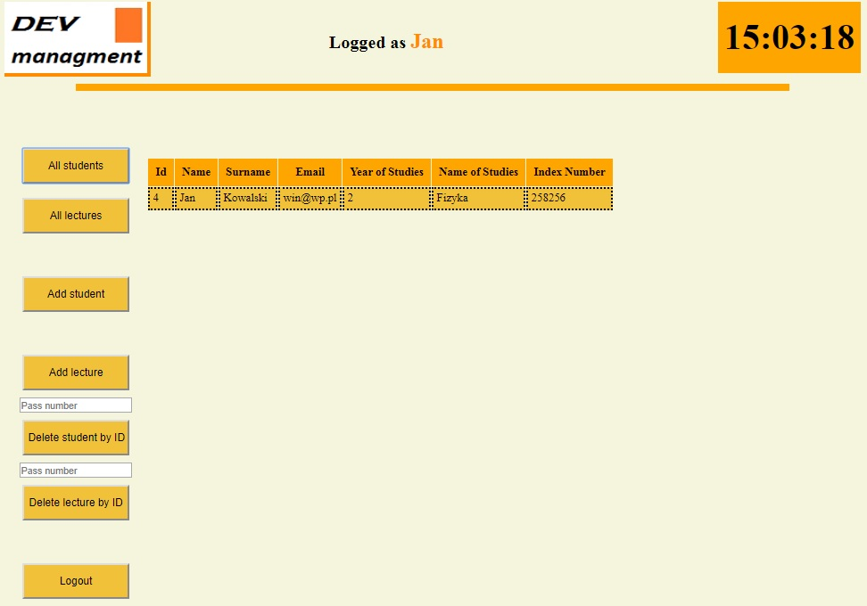
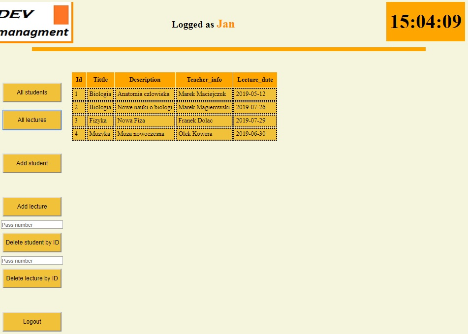

PROJECT NAME
#dev_manager

DESCRIPTION
Project to manage attendance list, by adding lectures, students, and attendances to lectures.

USAGE

!!!Important

Project starts with localhost:8080/login and automaticly create user with

login: Jan

password: admin

login : Kamil

password: student

Admin panel contains additional opportunities for example:

-creating student account

-addind new lecture

-delete lecture 

-delete student

-view all students list

Student panel is able to add user to attendance and display his all attendencies

