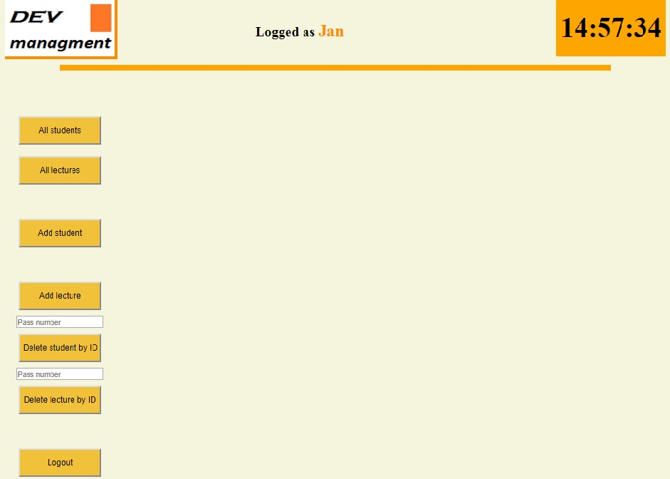

PROJECT NAME
#dev_manager

DESCRIPTION
Project to manage attendance list, by adding lectures, students, and attendances to lectures.

USAGE

!!!Important
Project starts with localhost:8080/login and automaticly create user with:
login: Jan
password: admin
and 
login : Kamil
password: student

Admin panel contains additional opportunities for wxample:
-creating student account
-addind new lecture
-delete lecture, 
-delete student

Student panel is able to add user to attendance and display his all attendencies

